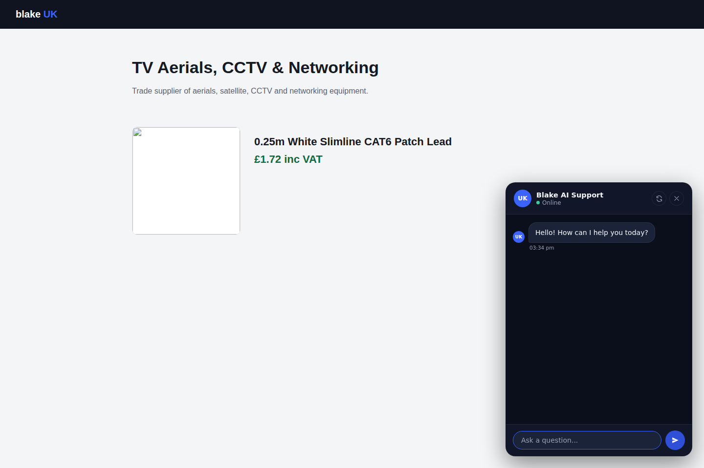
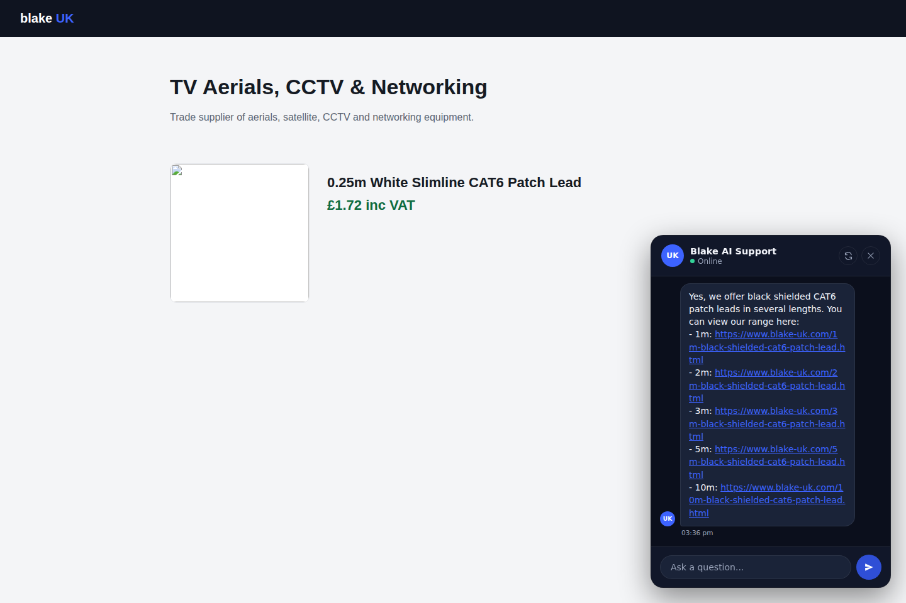
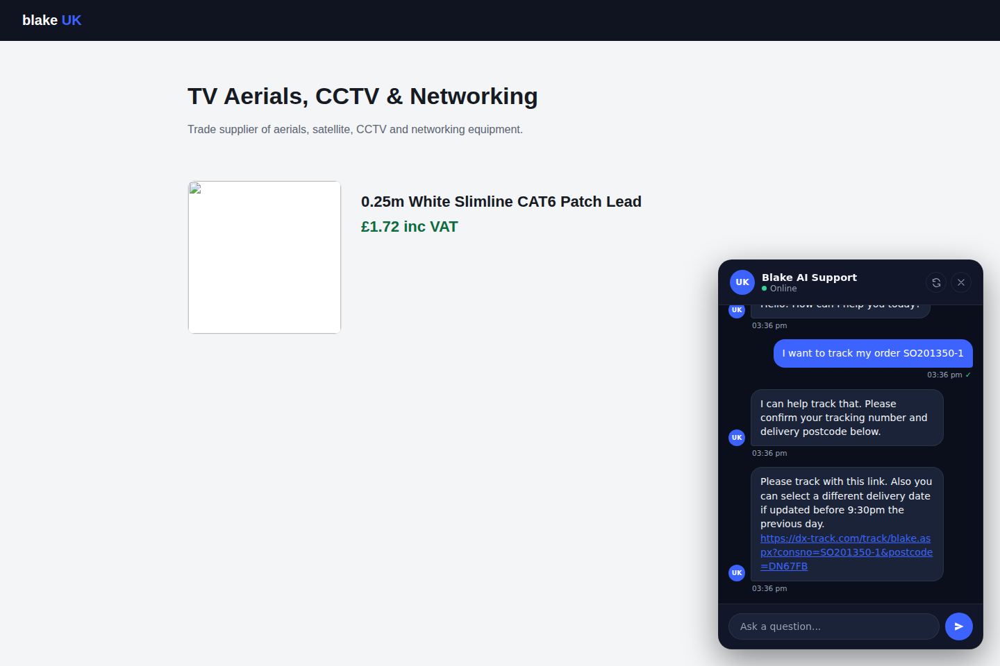
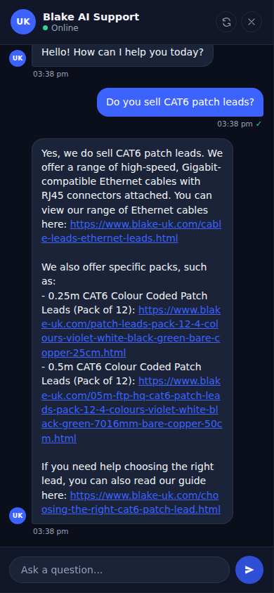

# Blake UK AI Support Chatbot

> **© 2026 Blake UK Ltd — Proprietary Software. All Rights Reserved.**
> Unauthorised copying, modification or distribution is strictly prohibited.
> See [LICENCE](./LICENCE) for full terms including GDPR (UK) compliance statement.

A self-hosted, RAG-powered customer support and product assistant for [blake-uk.com](https://www.blake-uk.com), plus the internal helpdesk (tickets, live chat, department routing, Telegram alerts) that sits behind it.
Built on **Caddy + PHP 8.2 + SQLite**. Powered by **Google Gemini**. No Node.js, no React, no pip.

---

## Table of Contents

- [Screenshots](#screenshots)
- [What's Built](#whats-built)
- [Tech Stack](#tech-stack)
- [One-Line Install](#one-line-install)
- [Manual Setup](#manual-setup)
- [Admin Interface](#admin-interface)
- [Mobile Apps (Android)](#mobile-apps-android)
- [Operator Console (Desktop)](#operator-console-desktop)
- [Embedding the Widget](#embedding-the-widget)
- [External Widget API](#external-widget-api)
- [Product Feed Import](#product-feed-import)
- [Carrier Tracking](#carrier-tracking)
- [Support Tickets & Live Chat](#support-tickets--live-chat)
- [Auto-Generated FAQ](#auto-generated-faq)
- [Telegram Staff Alerts](#telegram-staff-alerts)
- [Team Channels](#team-channels)
- [Testing](#testing)
- [Security](#security)
- [GDPR (UK) Compliance](#gdpr-uk-compliance)
- [File Structure](#file-structure)
- [Licence](#licence)

---

## Screenshots

### Chat Widget — Fresh Conversation

> The widget floats bottom-right on any blake-uk.com page. Dark theme, a "UK" avatar badge, live online status, and a working refresh (start new conversation) icon in the header — all built vanilla JS/CSS, no framework.



---

### Chat Widget — Grounded Product Answer

> A real answer from the live system: grounded in indexed knowledge, with direct blake-uk.com links rendered as clickable text (not just plain URLs) and a timestamp with a sent tick on the customer's own message.



---

### Chat Widget — Order Tracking

> The bot detects tracking intent, asks for the order/tracking number and postcode, then hands back a direct carrier tracking link with the agreed message text — built from the customer's own Sales Order number for DX, or a bare consignment number for DPD, with no carrier API account needed for either.



---

### Chat Widget — Mobile

> Full-width on mobile with the same dark theme and clickable links, touch-friendly input and send button.



---

### Admin Panel & Operator Console

The admin panel and operator console have both changed substantially since the last screenshots were taken — new tabs (FAQ, Live Chat controls, Telegram Settings with per-department routing, a presence toggle), a redesigned Tickets view, and more. Fresh screenshots of these need an authenticated session, which this update didn't have — see the [Admin Interface](#admin-interface) and [Operator Console](#operator-console-desktop) sections below for what's actually there now, and swap in real screenshots next time someone's logged in.

## What's Built

This started as a phased roadmap (Phase 1 Core → Phase 6 Analytics). Most of it is built now, so this section describes current capability directly rather than by phase.

### Customer-facing widget

| Feature | Detail |
|---|---|
| Embeddable chat widget | Single `<script>` tag, vanilla JS/CSS, no dependencies, dark theme |
| Gemini RAG pipeline | Retrieves knowledge chunks → builds grounded prompt → Gemini answers |
| Product-aware answers | Current page URL + `data-product-code`/`data-category` sent with every message |
| Inline product cards + clickable links | Structured product results render as cards; any URL in a plain-text answer is auto-linked |
| Auto-generated FAQ suggestions | Quick-question chips built from real, grounded past answers — see [Auto-Generated FAQ](#auto-generated-faq) |
| Order tracking | DX and DPD: direct carrier tracking links from order/tracking number (+ postcode for DX). Royal Mail: carrier-API path, not yet connected to a real account |
| Escalation to ticket **or** live chat | Low-confidence answer offers a choice — raise a ticket, or talk to a person now if one's online — see [Support Tickets & Live Chat](#support-tickets--live-chat) |
| Session logging | Page URL, product code, messages, confidence, escalation flag, all in SQLite |
| Confidence scoring | Heuristic based on RAG hits; low-confidence triggers the escalation choice |

### Admin panel & operator console

| Feature | Detail |
|---|---|
| Knowledge base | Manual text entries + PDF/DOCX/image upload, Gemini-extracted, chunked, FTS5-indexed |
| Website page indexing | Crawl/index live blake-uk.com pages by sitemap, with a daily scheduled re-crawl |
| Keyword links | Pin a phrase to a page so it's always offered to the AI when a customer's message contains it |
| Product catalogue | JSON/XML feed import (upsert), variants, related products, structured product cards in chat |
| Product page auto-extraction | Queue-driven extraction of structured product data straight from live product page URLs, with a confirmed template you can reuse |
| Support tickets | Department routing (AI-guessed, staff-correctable), SLA deadlines by priority, notes, staff-created tickets with no chat session |
| Live chat handoff | Presence-gated human takeover of a chat session — claim, converse, end, all polling-driven |
| Staff presence | Online / Busy / Offline toggle in both the web admin and the operator console — gates whether live chat is even offered |
| Telegram staff alerts | New ticket, reassignment, and live-chat-request alerts, with inline buttons to forward departments and a one-tap "reply by email" link |
| Auto-generated FAQ | Admin edit/delete over entries the system builds itself from real grounded answers |
| Team channels | Internal group chat with @mentions and reply-threading, separate from customer conversations |
| Reminders | Attach a follow-up reminder to a ticket, due-check notifications in the operator console |
| Projects & tasks | Nested project workspaces, Kanban/table views, assignees, visible only to admins and assigned members |
| Correction workflow | Staff corrects a bad bot answer directly from the chat log |
| 2FA | TOTP with QR enrolment and backup codes |
| Encrypted credentials | Gemini and carrier keys, AES-256-GCM, never returned to the browser after saving |
| Live Gemini model picker | Fetched from Google's API, filtered to chat-capable models only |
| Audit log | Every admin action, with a Dashboard activity feed |

### Mobile & desktop clients

Native Android apps (Flutter) and a native desktop app (Tauri, Windows + Linux) — see [Mobile Apps](#mobile-apps-android) and [Operator Console](#operator-console-desktop).

---

## Tech Stack

| Layer | Choice | Reason |
|---|---|---|
| Web server | Caddy 2 | Automatic HTTPS (Let's Encrypt), zero-config TLS, PHP-FPM proxy |
| Language | PHP 8.2 | No runtime install, fast FPM, native cURL, OpenSSL, PDO |
| Database | SQLite 3 (FTS5) | Zero-config, WAL mode, built-in full-text search, no server process |
| AI — chat | `gemini-3.5-flash-lite` (default) | Fast and cheap, appropriate for RAG-grounded support chat where the model isn't doing the heavy lifting |
| AI — extraction | `gemini-3.6-flash` (default) | Multimodal: reads PDF, DOCX, images natively; more capability held back for parsing document/image structure accurately |
| Frontend | Vanilla HTML/CSS/JS | No build toolchain, no npm, embeds with one script tag |
| Deployment | Debian 12 VPS | Stable LTS, `apt` packages, simple systemd services |

**Deliberately excluded:** React, pip/Python, Docker, Redis, Elasticsearch. (Node.js is used only as a local syntax-checking tool during development — `node --check` — never as a runtime dependency of the deployed app.)

Model names are configurable per deployment via Admin → Model Settings, and are re-verified against Google's live model list rather than hardcoded — the ones above are what this deployment currently uses, not a permanent pin. Gemini 1.5 Flash/Pro (the original defaults) were retired by Google and are no longer valid choices.

---

## One-Line Install

On a **fresh Debian 12 VPS** as root, with DNS for `chat.blakegroup.uk` pointing to the server:

```bash
bash <(curl -fsSL https://raw.githubusercontent.com/BlakeUK/Blake-AI-Chatbot/main/install.sh)
```

Custom domain:

```bash
DOMAIN=chat.example.com bash <(curl -fsSL https://raw.githubusercontent.com/BlakeUK/Blake-AI-Chatbot/main/install.sh)
```

**What the installer does:**
1. Updates system packages
2. Installs PHP 8.2-FPM + extensions (sqlite3, curl, mbstring, xml, intl, fileinfo)
3. Installs SQLite3, Git, Caddy (via official Cloudsmith repo)
4. Clones this repo to `/var/www/chat`
5. Initialises the SQLite database — `schema.sql` plus every `schema_*.sql` migration in `scripts/`, applied in order
6. Auto-generates a 32-byte AES encryption key and writes `config/config.php`
7. Configures Caddy with HTTPS
8. Starts `caddy` and `php8.2-fpm` via systemd, plus the cron jobs listed under [File Structure](#file-structure)

**Idempotent** — safe to re-run on an existing install (pulls latest code, skips DB/config if they exist, applies any migration not yet applied).

---

## Manual Setup

### Prerequisites
- Debian 12 VPS (1 vCPU / 1 GB RAM minimum recommended)
- Root SSH access
- DNS A record: `chat.blakegroup.uk` → VPS IP address

### Step 1 — Clone
```bash
git clone https://github.com/BlakeUK/Blake-AI-Chatbot.git /var/www/chat
```

### Step 2 — Install dependencies
```bash
apt-get update
apt-get install -y php8.2-fpm php8.2-sqlite3 php8.2-curl php8.2-mbstring \
    php8.2-xml php8.2-intl php8.2-fileinfo sqlite3 git curl gnupg \
    debian-keyring debian-archive-keyring apt-transport-https

# Caddy
curl -1sLf 'https://dl.cloudsmith.io/public/caddy/stable/gpg.key' | \
    gpg --dearmor -o /usr/share/keyrings/caddy-stable-archive-keyring.gpg
curl -1sLf 'https://dl.cloudsmith.io/public/caddy/stable/debian.deb.txt' | \
    tee /etc/apt/sources.list.d/caddy-stable.list
apt-get update && apt-get install -y caddy
```

### Step 3 — Initialise database
```bash
mkdir -p /var/www/chat/{data,uploads,logs,config}
sqlite3 /var/www/chat/data/chatbot.db < /var/www/chat/scripts/schema.sql
for f in /var/www/chat/scripts/schema_*.sql; do
    sqlite3 /var/www/chat/data/chatbot.db < "$f"
done
chown -R www-data:www-data /var/www/chat
chmod 750 /var/www/chat/config
chmod 770 /var/www/chat/{data,uploads,logs}
```

`scripts/deploy_remote.sh` (what the GitHub Actions deploy workflow actually runs) applies each migration guarded by an existence check instead of looping blindly — worth reading if you're setting up by hand and want the same idempotency.

### Step 4 — Configure
```bash
cp /var/www/chat/config/config.example.php /var/www/chat/config/config.php

# Generate encryption key
php -r "echo bin2hex(random_bytes(32));"
# Paste output into config.php encrypt_key value

# Generate mobile app key (only needed if you build mobile/customer_app —
# see "Mobile Apps" below for where the matching value goes)
php -r "echo bin2hex(random_bytes(24));"
# Paste output into config.php mobile_app_key value

nano /var/www/chat/config/config.php
```

### Step 5 — Caddy
```bash
cp /var/www/chat/Caddyfile /etc/caddy/Caddyfile
systemctl enable caddy php8.2-fpm
systemctl restart caddy php8.2-fpm
```

### Step 6 — Create admin user
```bash
php /var/www/chat/scripts/create_admin.php admin 'YourStrongPassword'
```

Or remotely, without SSH: run the **Create Admin User** workflow from the [Actions tab](https://github.com/BlakeUK/Blake-AI-Chatbot/actions/workflows/create-admin.yml) (`workflow_dispatch`), which creates or resets the account named in the `ADMIN_USERNAME`/`ADMIN_PASSWORD` repo secrets.

### Step 7 — Cron jobs

The deploy workflow installs these automatically; doing it by hand needs a `www-data` crontab entry per script in `scripts/` that says so in its own header comment (currently: pending-file extraction, product page extraction, Telegram update polling, and the scheduled site refresh — see [File Structure](#file-structure)).

---

## Admin Interface

Visit `https://chat.blakegroup.uk/admin/` and log in.

### Tabs

| Tab | Purpose |
|---|---|
| **Dashboard** | Live counts (knowledge entries, indexed files, products, sessions), recent chat sessions, and an audit-log activity feed. |
| **Knowledge** | Create / delete manual text knowledge entries. Instantly FTS5-indexed into RAG. |
| **Keyword Links** | Pin specific words/phrases to a specific page — guaranteed to be offered to the AI whenever a customer's message mentions one, independent of whether search happens to find it. |
| **Files / RAG** | Upload PDFs, images, DOCX, CSV etc. Gemini extracts text, chunks it, indexes it. A **Scan All** action batch-processes anything pending/errored with pacing and a cancel option. Optionally tag a batch with a category to boost its relevance on a matching product page. A **Pages** sub-tab indexes a live website page's actual body content and can run a one-off sitemap scan or, under **Scheduled Site Refresh**, a daily background re-crawl. A byte-identical re-upload is skipped automatically; anything merely similar surfaces under **Possible Duplicates** for review — never deleted automatically. |
| **Products** | Import a JSON or XML product feed, or let the product-page extraction queue pull structured data straight from live product URLs using a confirmed template. Searchable product table, import result summary. |
| **FAQ** | Entries the system builds itself from grounded chat answers (see [Auto-Generated FAQ](#auto-generated-faq)) — edit the wording or delete anything that shouldn't be there. |
| **API Keys** | Store Gemini and carrier keys (AES-256-GCM encrypted, never shown after save). |
| **Model Settings** | Fetch the live Gemini model list from Google's API. Set chat and extraction models separately, with a connection health check. |
| **Widget Clients** | Create external API clients. Lock to IP addresses (CIDR supported) and/or origin domains. |
| **Users** | Add staff accounts, assign admin/editor/user roles, assign departments, reset a user's 2FA. |
| **Chat Logs** | Browse all customer sessions; review any conversation and correct bad bot answers. |
| **Support Tickets** | Filter by status and department. Reassign department (with a Telegram alert to whoever's now on it), add notes, and claim/converse/end a live chat directly from the ticket detail view when one's pending or active. |
| **Telegram Settings** *(within Model Settings)* | Bot token, a default staff chat, and optional per-department overrides so Sales/Technical/Accounts alerts can go to different chats — see [Telegram Staff Alerts](#telegram-staff-alerts). |
| **Project Planner** | Board-style task tracking (grouped table and a To do/In progress/Done Kanban board) on the same tables the Operator Console uses — a task created or moved on one client shows up the same way on the other. Visible only to admins and assigned members. |
| **My Account** | Change your own password, set your Online/Busy/Offline status, enable/disable 2FA with a scannable QR code and backup codes. |

### First-run checklist

- [ ] Log in at `/admin/`
- [ ] **API Keys** → paste Gemini key → Save
- [ ] **Model Settings** → Refresh → select models → Save
- [ ] **Knowledge** → add your first entry (e.g. delivery policy)
- [ ] **Files / RAG** → upload product PDFs, datasheets, manuals
- [ ] **Products** → upload your JSON/XML product feed
- [ ] Set your own status to **Online** (header toggle) if you want live chat offered to customers at all

---

## Mobile Apps (Android)

Two native Android apps (Flutter, not a WebView wrapper) talk to the same backend as the web admin panel and widget — no separate setup required.

| App | What it's for |
|---|---|
| **Blake UK Admin** | The full admin panel on your phone — login with 2FA, dashboard, knowledge base, files, products, API keys, model settings, widget clients, users, chat logs, support tickets, my account. |
| **Blake UK Support** | The customer-facing chat widget as a standalone app — chat, product cards, order tracking, support ticket escalation. |

**Download the latest build:**

- 📱 [Blake UK Admin (`.apk`)](https://github.com/BlakeUK/Blake-AI-Chatbot/releases/download/apk-latest/blake-uk-admin-app.apk)
- 📱 [Blake UK Support (`.apk`)](https://github.com/BlakeUK/Blake-AI-Chatbot/releases/download/apk-latest/blake-uk-customer-app.apk)

These links always point to the most recently built APKs — see the [`apk-latest` release](https://github.com/BlakeUK/Blake-AI-Chatbot/releases/tag/apk-latest) for build details. Since these aren't distributed via the Play Store, Android will ask you to allow "install from unknown sources" the first time.

Rebuilding: run the **Build Android APKs** workflow from the [Actions tab](https://github.com/BlakeUK/Blake-AI-Chatbot/actions/workflows/build-apk.yml) — it compiles both apps and updates the release above in place.

**One-time setup for the customer app:** set a `MOBILE_APP_KEY` repository secret (Settings → Secrets and variables → Actions) to the same value as your deployment's `config.php` `mobile_app_key`. The workflow bakes it into the app in place of the committed `CHANGE_ME_MOBILE_APP_KEY` placeholder before building — without it, the customer app can't start a chat session (see `public/api/chat/session.php`'s first-party check). The admin app doesn't need this; it authenticates with a login + session cookie instead.

Source: [`mobile/admin_app`](mobile/admin_app) and [`mobile/customer_app`](mobile/customer_app).

---

## Operator Console (Desktop)

Native desktop app (Windows + Debian/Linux, built with [Tauri](https://tauri.app)) for support staff: get notified when the chatbot needs a human, claim and converse in a live chat, hand tickets off between sales/technical/accounts or a specific colleague, and manage your own Online/Busy/Offline status — using the same login your team already uses on the admin panel.

**What's in it beyond the admin panel's own ticket view:**

| Feature | Detail |
|---|---|
| Presence toggle | Set your own Online/Busy/Offline status in the topbar — this is what gates whether the widget offers customers a live chat at all |
| Live chat claim/converse/end | Ticket list flags a waiting live chat; open it to claim, then a polling reply box for the actual conversation |
| Native desktop notifications | New tickets, tickets transferred to you, due reminders, channel @mentions |
| Team channels | Internal group chat and DMs, separate from customer conversations |
| Reminders | Attach a follow-up to a ticket for yourself or a colleague, with due-check notifications |
| Projects | Nested workspaces, Kanban board, assignees |

**Download the latest build:**

- 🪟 [Blake UK Operator Console (`.exe`, Windows)](https://blakegroup.uk/downloads/blake-uk-operator-console-setup.exe)
- 🐧 [Blake UK Operator Console (`.deb`, Debian/Ubuntu)](https://blakegroup.uk/downloads/blake-uk-operator-console.deb)

These links always point to the most recently *published* build. The app checks `https://blakegroup.uk/downloads/version.json` every 5 minutes and shows an in-app **Update** button when a newer version is available — but that manifest is only regenerated when someone actually publishes a release (see below), so bumping the version number in `tauri.conf.json` alone does **not** ship anything or prompt existing installs to update.

**Publishing a new build:** run the **Build Operator Console** workflow from the [Actions tab](https://github.com/BlakeUK/Blake-AI-Chatbot/actions/workflows/build-operator-console.yml) (`workflow_dispatch` — it isn't triggered automatically by pushes to `main`). It builds the Windows installer as an NSIS `.exe` (not `.msi`) and the `.deb`, then uploads both plus a fresh `version.json` to the VPS at the stable filenames above. NSIS is set to `installMode: currentUser`, so install and self-update both run without Administrator rights — needed for staff on locked-down PCs.

Source: [`operator-console`](operator-console) — see [`operator-console/README.md`](operator-console/README.md) for build-environment setup. Note: the Rust/Tauri build has not been verified on a real Windows machine as of this update — it's been syntax-checked and the build workflow validated structurally, but not confirmed end-to-end on real Windows hardware.

---

## Embedding the Widget

### On blake-uk.com (direct embed)

Add before `</body>` on every page:

```html
<script src="https://chat.blakegroup.uk/widget/chat.js" defer></script>
```

### Product page context

Add `data-` attributes near the product content so the widget knows which product the customer is viewing:

```html
<div data-product-code="BLAUUTP-0025M-WHITE" data-category="Networking"></div>
```

The widget automatically picks these up and sends them with every message, enabling product-aware answers.

### On an external website (API key method)

1. Admin → **Widget Clients** → create a client, set allowed IPs and allowed origin
2. Copy the API key shown **once** at creation
3. On the external site:

```html
<script>
window.BlakeUKWidget = {
  apiKey: 'buk_yourkey',
  endpoint: 'https://chat.blakegroup.uk'
};
</script>
<script src="https://chat.blakegroup.uk/widget/chat.js" defer></script>
```

---

## External Widget API

For server-side integrations or custom widget implementations.

### Token flow

```
POST /api/widget/init.php
Content-Type: application/json

{ "api_key": "buk_yourkey" }
```

Response:
```json
{ "token": "abc123...", "expires_in": 300 }
```

Use the token within 5 minutes to open a chat session at `/api/chat/session.php`.

### Security controls

| Control | Detail |
|---|---|
| IP allowlist | Per-client list of permitted server IPs. Supports CIDR notation (e.g. `192.168.0.0/24`) |
| Origin allowlist | Per-client list of permitted HTTP `Origin` header values |
| Rate limiting | 10 token requests per minute per IP |
| Token expiry | 5-minute expiry, single-use |
| Audit log | Every issuance, IP block, origin block and invalid key logged to `widget_access_log` |
| Key masking | API keys masked in all list endpoints — full key shown once at creation only |
| Key revocation | Instant revocation from admin UI; existing tokens expire naturally |

---

## Product Feed Import

### Via Admin UI

Admin → **Products** tab → drag-and-drop JSON or XML file. Or use the **product page extraction queue** to pull structured data directly from live product page URLs instead of a feed file — confirm a template once and it's reused for the rest of the queue.

Import result shows:

| Count | Meaning |
|---|---|
| Created | New products added to database |
| Updated | Existing products updated |
| Skipped | Records missing required fields (product_code, name) |
| Errors | Records that threw an exception (logged with product code) |

### Via API

```
POST /api/admin/import.php
X-CSRF-Token: <token from login>
Content-Type: multipart/form-data

feed=<file.json or file.xml>
```

### Required JSON format

```json
{
  "products": [
    {
      "product_code": "BLAUUTP-0025M-WHITE",
      "name": "0.25m White Slimline CAT6 Patch Lead",
      "url": "https://www.blake-uk.com/0-25m-white-slimline-cat6-patch-lead.html",
      "category_path": ["Networking", "Patch Leads", "CAT6"],
      "price": { "inc_vat": 1.72, "exc_vat": 1.43 },
      "stock": { "status": "in_stock" },
      "images": [{ "url": "https://www.blake-uk.com/images/products/BLAUUTP-0025M-WHITE.jpg", "alt": "White CAT6 patch lead" }],
      "summary_bullets": ["Efficient CAT6 networking", "Slim for tight spaces", "Gold-plated connectors"],
      "tech_specs": { "cable_category": "CAT6", "shielding": "U/UTP", "length_m": 0.25, "colour": "White" },
      "variants": [
        { "product_code": "BLAUUTP-0025M-BLACK", "attributes": { "colour": "Black" }, "url": "https://www.blake-uk.com/..." }
      ],
      "documents": [
        { "type": "manual", "title": "Instruction Manual", "url": "https://www.blake-uk.com/instruction-manuals.html" }
      ],
      "search_terms": ["cat6", "patch lead", "ethernet", "slimline", "network cable"]
    }
  ]
}
```

The importer tolerates alternative field naming conventions (`productCode`, `categoryPath`, `incVat`, etc.) and XML feeds from bespoke systems including FUSE-based e-commerce backends.

---

## Carrier Tracking

The bot detects tracking intent from natural language ("where is my order", "has it shipped") or a recognisable order/tracking number pattern, and hands the customer a direct link.

| Carrier | How it works | Status |
|---|---|---|
| **DX** | Blake's own white-label DX tracking page, looked up by Blake's Sales Order number (shown top-right on a sales order, top-left on a despatch note) plus the delivery postcode. No DX API account involved — see `Tracking\LinkBuilder::dx()`. | Live |
| **DPD** | Direct `track.dpd.co.uk` link built from the bare consignment number plus a fixed depot prefix and account code specific to this account. No DPD API account involved — see `Tracking\LinkBuilder::dpd()`. | Live |
| **Royal Mail / Post Office** | Carrier-API path (`Tracking\Dispatcher`) exists but has no real account connected yet — falls through to "not yet set up, contact support" until an API key is added under Admin → API Keys. | Not connected |

Every tracking request is logged to `tracking_requests` regardless of carrier, whether it resolved to a direct link or a real API query.

---

## Support Tickets & Live Chat

When the bot can't answer with enough confidence, the customer is offered a choice: raise a ticket, or talk to a person right now — but live chat is only offered if a staff member has actually set their status to **Online** (My Account / operator console topbar). Busy or Offline, and it's ticket-only.

### Tickets

- Created automatically on escalation (email required — a ticket nobody can reply to isn't useful) or manually by staff with no chat session attached
- Routed to a department (Sales/Technical/Accounts) by `Chat\DepartmentClassifier`, staff-correctable at any time from the ticket detail view or a Telegram forward button
- SLA deadline set by priority (`Tickets\Sla`: 2h urgent / 8h high / 24h medium / 72h low)
- Notes, status (open/in_progress/waiting/resolved/closed), and a full transcript link back to the originating chat session
- Every ticket action (creation, reassignment) fires a Telegram alert if configured — see [Telegram Staff Alerts](#telegram-staff-alerts)
- **Replying stays outside the system** — no SMTP/email-sending is built. The customer's email is a tap-to-email `mailto:` link everywhere it's shown (ticket list, ticket detail, Telegram alert), pre-filled with "Re: {subject}", so staff reply from their own inbox with one tap rather than a copy-paste job

### Live chat

- `Chat\LiveChat` drives the whole handoff: request → claim → converse → end, all on top of `chat_sessions.mode`, which is also what stops the AI answering once a human has this — enforced server-side in `send.php`, not just a widget-side convention
- Claiming is race-safe (the mode check lives in the claiming `UPDATE`'s `WHERE` clause, not a preceding read) and open to any currently-online admin regardless of department — urgency beats routing here
- The customer's widget polls every 4 seconds for the agent's replies once live; staff see the same cadence in the admin panel/operator console
- Reuses the same `support_tickets` table (tagged `channel = 'live_chat'`) rather than a second parallel queue, so it gets the same department routing, ticket list, and Telegram alert as any other ticket — the alert deliberately has no "claim" button, since claiming only makes sense somewhere you can actually type a reply back, which Telegram itself isn't

---

## Auto-Generated FAQ

Every grounded chat answer (confidence high enough that it wasn't escalated) is a candidate FAQ entry. `Faq\Builder` dedupes new questions against existing entries — exact match first, then a word-overlap check for rephrasings ("how long does delivery take" / "what are your delivery times") — and only ever increments a hit counter on a match, never rewrites the stored text, so an admin's edit can't be silently reverted by a later, differently-worded answer to the same question. Anything that looks like it contains an email address, an order/tracking number, or a UK postcode is never captured, since it has no business becoming a public FAQ entry.

The widget shows the most-asked entries as quick-question chips under the greeting; Admin → **FAQ** is where staff edit or delete anything that shouldn't be there.

---

## Telegram Staff Alerts

One-way from the system to staff — the bot never reads anything back from Telegram except inline-button taps, and it never talks to customers through it.

- **New ticket**, **department reassignment**, and **live chat requested** each fire an alert, labelled with department, to either a shared default chat or a per-department override (Admin → Model Settings → Telegram Settings)
- Ticket alerts carry inline buttons: forward to whichever department it isn't already in, and (when there's an email on file) a "Reply by email" button that opens the tapper's own mail app pre-addressed
- Button taps are picked up by a cron script polling Telegram's `getUpdates` every minute — deliberately not a public webhook, so there's no new inbound endpoint to secure, at the cost of up to a minute's latency between a tap and it taking effect
- Setup: message your bot once on Telegram, then Admin → Model Settings → Telegram Settings → **Detect Chat ID**, pick which field (default or a specific department) each discovered chat should fill

---

## Team Channels

A separate internal group chat/DM system for staff-to-staff conversation — channels with named members, @mentions, and reply-threading, distinct from any customer-facing conversation. Lives in the operator console; `channels.php`/`channel_notify.php` back it. Not connected to the customer widget or to Telegram in any way — purely internal.

---

## File Structure

```
/
├── Caddyfile                       Web server config
├── LICENCE                         Proprietary licence + GDPR statement
├── README.md                       This file
├── install.sh                      One-line VPS installer
├── config/
│   └── config.example.php          Config template (copy to config.php)
├── data/                           SQLite database (gitignored)
├── docs/
│   └── img/                        Screenshots for this README
├── logs/                           Application logs (gitignored)
├── mobile/
│   ├── admin_app/                  Flutter admin app (Android)
│   └── customer_app/               Flutter customer chat app (Android)
├── operator-console/                Tauri desktop app (Windows/Linux)
│   ├── dist/index.html             The actual UI — login, tickets, live chat, presence, channels, projects, reminders
│   └── src-tauri/                  Rust shell
├── public/                          Caddy web root
│   ├── admin/index.html            Admin single-page UI (all tabs, one file)
│   ├── api/
│   │   ├── admin/                  ~35 endpoints: tickets, presence, live_chat, telegram, faq, channels, reminders,
│   │   │                           projects, products, files, knowledge, users, keyword_links, product_template...
│   │   ├── chat/                   send, session, escalate, track, faq (public), live_request/send/poll
│   │   └── widget/init.php         External widget token issuance
│   ├── check/                      Separate sitemap diagnostic tool, its own login (src/Auth/CheckTool.php)
│   └── widget/                     chat.css / chat.js — the embeddable widget
├── scripts/
│   ├── schema.sql                  Base schema
│   ├── schema_*.sql                One file per incremental migration, applied in order, each guarded/idempotent
│   ├── deploy_remote.sh            What the deploy workflow actually runs on the VPS
│   ├── create_admin.php            CLI: create/reset admin user
│   ├── process_pending_files.php   Cron: extract any pending/errored knowledge files
│   ├── process_product_pages.php   Cron: work through the product-page extraction queue
│   ├── process_telegram_updates.php Cron: poll for Telegram button taps
│   └── refresh_site_pages.php      Cron: scheduled site re-crawl
├── src/
│   ├── Auth/                       Admin session/CSRF/2FA, the separate check-tool login
│   ├── Chat/                       Responder (RAG), DepartmentClassifier, LiveChat
│   ├── Faq/Builder.php             Auto-generated FAQ capture/dedup
│   ├── Gemini/Client.php           All Gemini call sites consolidated here
│   ├── Knowledge/                  FileExtractor, PageIndexer, Search (FTS5), KeywordLinks, Dedup
│   ├── Products/                   Importer, PageExtractor
│   ├── Sitemap/                    Parser, RobotsTxt, PageAnalyzer, link extraction
│   ├── Telegram/Notifier.php       Alerts + inline-button keyboard building
│   ├── Tickets/                    Service (shared mutation logic), Sla
│   ├── Tracking/                   Detector, Dispatcher (carrier API, unused), LinkBuilder (DX/DPD direct links)
│   └── bootstrap.php               DB, autoload, CORS, rate limiting
├── tests/
│   ├── run.php                     Fast suite entry point
│   ├── cases/                      One file per unit under test
│   ├── fixtures/seed.php           Known fixture knowledge/products
│   └── eval/                       Live Gemini answer-quality eval (separate, slower, scheduled)
└── uploads/                        Uploaded knowledge files (gitignored)
```

---

## Testing

Two suites, both under `tests/` — no Composer/PHPUnit, just plain PHP, matching the rest of the project's "no build step" approach.

### Fast suite

```bash
php tests/run.php
```

No network calls, no LLM, runs in seconds. Builds a throwaway SQLite DB from the real `scripts/schema*.sql` files (every migration, not just the base schema), seeds known fixture knowledge/products (`tests/fixtures/seed.php`), then checks retrieval, product import parsing, confidence/escalation, department routing, ticket reassignment, live chat handoff, the FAQ dedup logic, carrier link building, and the Telegram alert keyboard — 265 tests as of this update, all passing.

Runs automatically on every pull request and push to `main` ([`.github/workflows/test.yml`](.github/workflows/test.yml)).

### Live RAG answer-quality eval

```bash
GEMINI_API_KEY=your-key php tests/eval/run.php
```

Runs a curated set of real support questions ([`tests/eval/cases.php`](tests/eval/cases.php)) through the exact same retrieval-and-prompt code the chat endpoint uses (`src/Chat/Responder.php`), but with a real Gemini call — checking the actual answer text, not just whether the prompt was built correctly. Costs real API usage, so it isn't run on every PR — it runs nightly and on demand ([`.github/workflows/rag-eval.yml`](.github/workflows/rag-eval.yml)), and needs a `GEMINI_API_KEY` repository secret. Skips cleanly (not a failure) if that secret isn't set.

### Adding a fixture or case

New knowledge chunks/products for the fast suite go in `tests/fixtures/seed.php`; new eval questions go in `tests/eval/cases.php`. Both are plain PHP arrays with comments explaining the expected shape.

---

## Security

| Measure | Implementation |
|---|---|
| Admin passwords | bcrypt (`password_hash` / `password_verify`), account lockout after repeated failures |
| Two-factor auth | TOTP, QR enrolment, backup codes |
| API key encryption | AES-256-GCM, random 12-byte IV, auth tag stored separately |
| CSRF protection | Token per session, validated on all state-changing admin operations |
| Rate limiting | SQLite sliding window, per endpoint (chat, admin login, widget token issuance, live chat, tracking...) |
| IP hashing | Customer IPs stored as SHA-256 hashes only — not reversible |
| Session cookies | `HttpOnly`, `Secure`, `SameSite=None` (needed for the Tauri operator console's cross-site origin) |
| File uploads | MIME-type validated server-side, size-limited, random stored filename |
| CORS | Configurable origin allowlist; blocks all unlisted origins |
| Widget access | IP + origin allowlist per external client, short-lived tokens, full audit trail |
| Telegram | No public webhook — inbound button taps are picked up by a polling cron instead, so there's no new unauthenticated endpoint exposed |
| HTTPS | Caddy handles TLS automatically via Let's Encrypt |
| Headers | `X-Content-Type-Options`, `Referrer-Policy`, `Permissions-Policy` |

---

## GDPR (UK) Compliance

See [LICENCE](./LICENCE) Section 6 for the complete compliance statement.

| Obligation | How it is met |
|---|---|
| **Lawful basis** | Legitimate interests (Article 6(1)(f)) for customer support; consent where customer initiates chat |
| **Data minimisation** | Widget collects only: hashed IP, page URL, chat messages, and an email address only if the customer provides one to raise a ticket |
| **Retention** | No automated retention window and no admin deletion UI built yet for chat sessions or tracking data — currently persists until removed at the database level directly. Flagged here rather than left implied. |
| **Security** | AES-256-GCM keys, bcrypt passwords + 2FA, CSRF, rate limiting, IP hashing, secure cookies |
| **No 3rd-party tracking** | `sessionStorage` only. No analytics, no ad pixels, no third-party scripts. |
| **International transfers** | Google Gemini API (USA). Blake UK Ltd must maintain appropriate transfer mechanism (SCCs / UK-US Data Bridge). |
| **Data subject rights** | Blake UK Ltd (Data Controller) handles access, erasure, rectification requests manually. |
| **Processor agreement** | Any third-party deployer must execute a DPA with Blake UK Ltd (UK GDPR Article 28). |
| **Privacy notice** | Blake UK Ltd must publish a Privacy Notice covering this processing: [blake-uk.com/gdpr.html](https://www.blake-uk.com/gdpr.html) |

---

## Licence

**Proprietary — All Rights Reserved.**

© 2026 Blake UK Ltd. This software may not be copied, modified, distributed or used without the express written permission of Blake UK Ltd.

See [LICENCE](./LICENCE) for full terms and GDPR (UK) compliance documentation.

**Contact:** [blake-uk.com/contact-us.html](https://www.blake-uk.com/contact-us.html)
