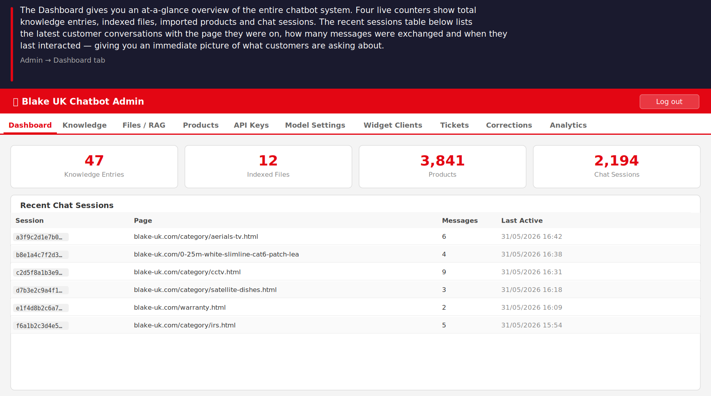
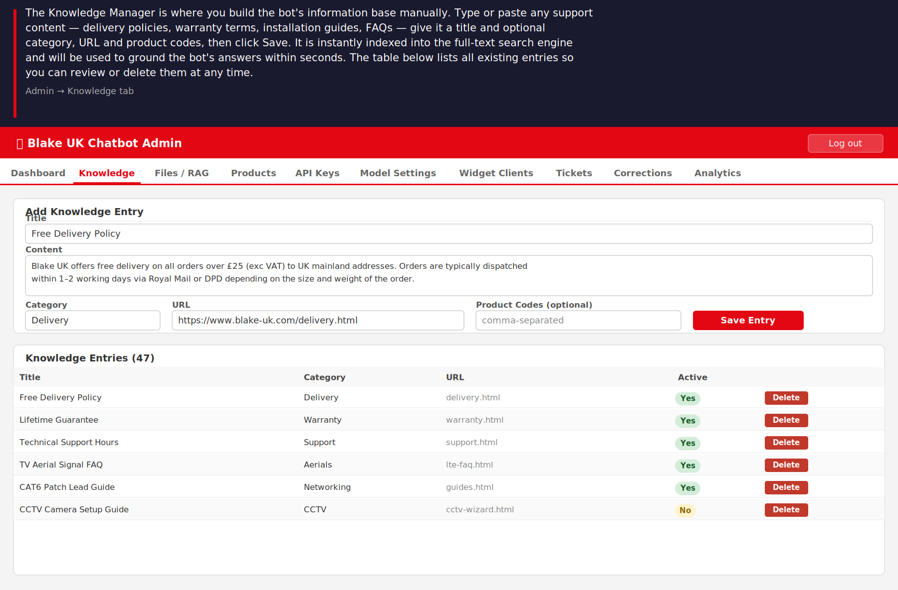
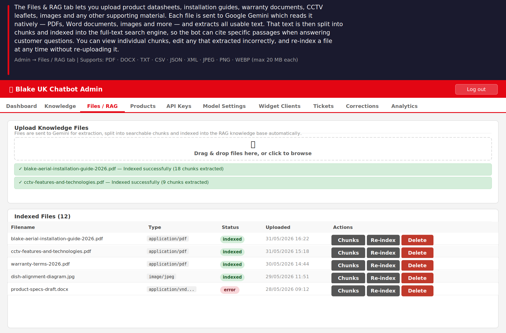
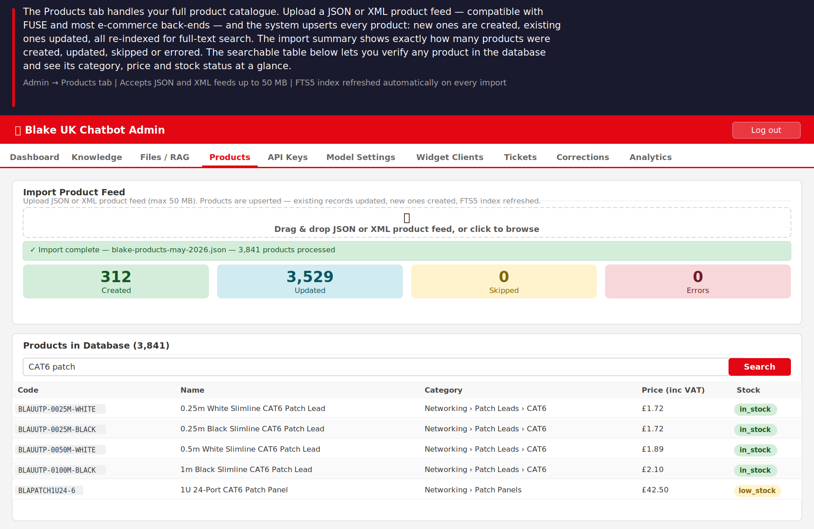
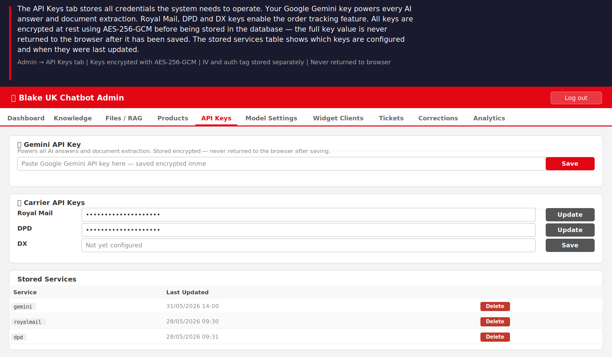
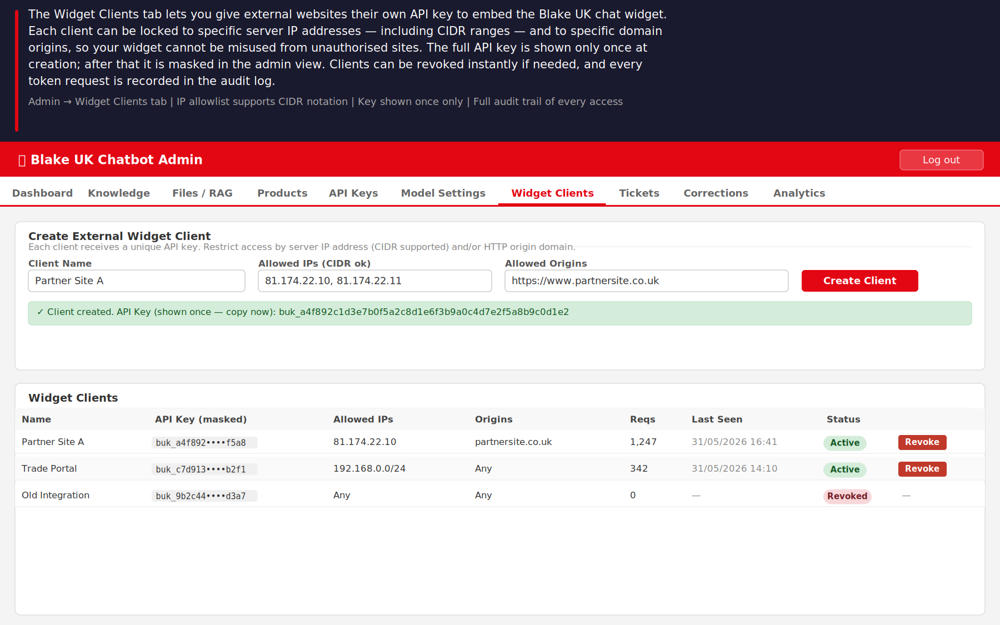
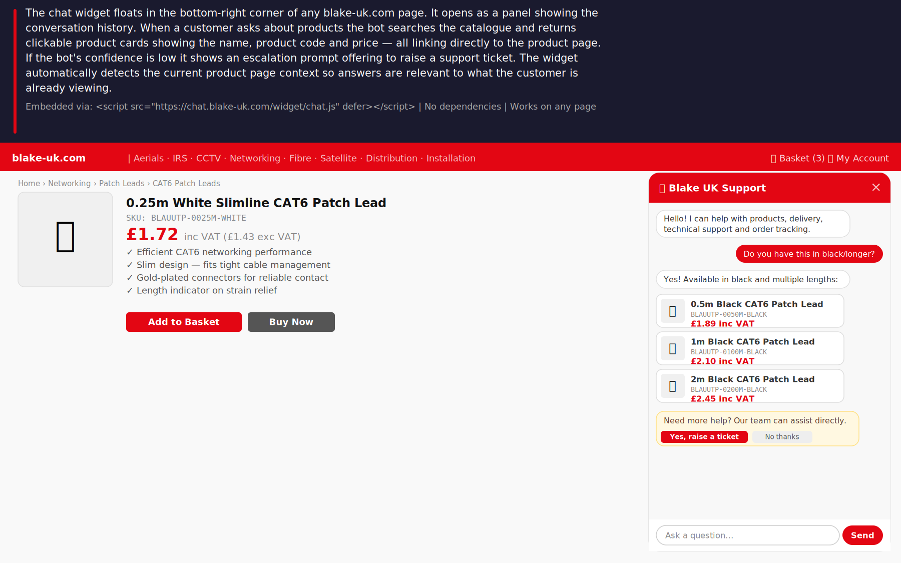
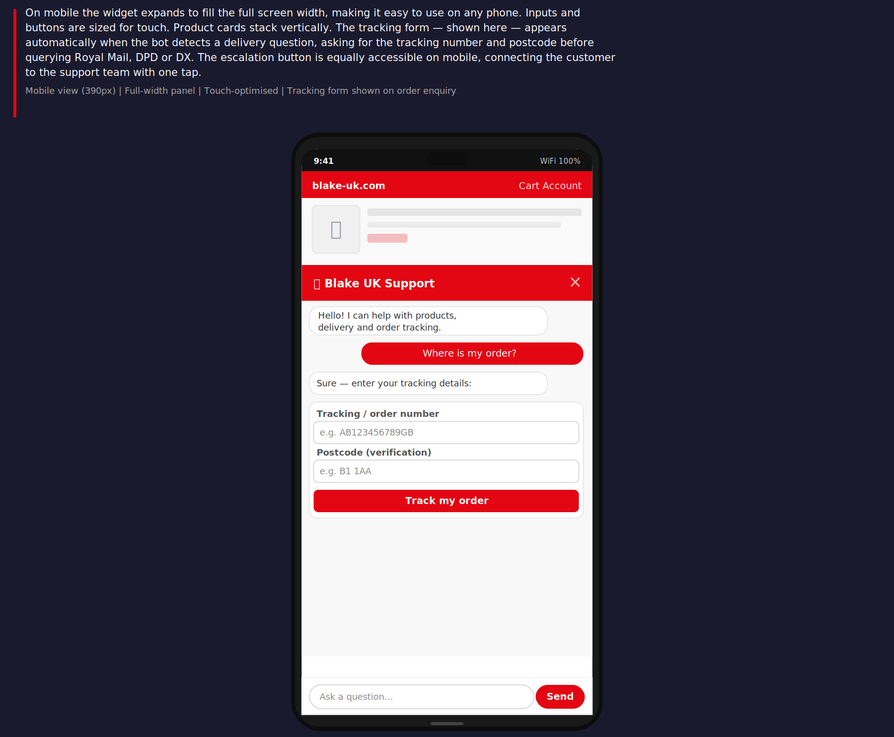

# Blake UK AI Support Chatbot

> **© 2026 Blake UK Ltd — Proprietary Software. All Rights Reserved.**
> Unauthorised copying, modification or distribution is strictly prohibited.
> See [LICENCE](./LICENCE) for full terms including GDPR (UK) compliance statement.

A self-hosted, RAG-powered customer support and product assistant for [blake-uk.com](https://www.blake-uk.com).
Built on **Caddy + PHP 8.2 + SQLite**. Powered by **Google Gemini**. No Node.js, no React, no pip.

---

## Table of Contents

- [Screenshots](#screenshots)
- [Features — Full Roadmap](#features--full-roadmap)
- [Tech Stack](#tech-stack)
- [One-Line Install](#one-line-install)
- [Manual Setup](#manual-setup)
- [Admin Interface](#admin-interface)
- [Mobile Apps (Android)](#mobile-apps-android)
- [Operator Console (Desktop)](#operator-console-desktop)
- [Embedding the Widget](#embedding-the-widget)
- [External Widget API](#external-widget-api)
- [Product Feed Import](#product-feed-import)
- [Carrier Tracking](#carrier-tracking)
- [Support Tickets](#support-tickets)
- [Testing](#testing)
- [Security](#security)
- [GDPR Compliance](#gdpr-uk-compliance)
- [Build Phases](#build-phases)
- [Licence](#licence)

---

## Screenshots

### Admin — Dashboard
> The Dashboard gives you an at-a-glance overview of the entire system. Four live counters show knowledge entries, indexed files, imported products and total chat sessions. The recent sessions table shows what customers are asking about, which page they were on, and when they last interacted.



---

### Admin — Knowledge Manager
> Build the bot's information base manually. Paste any support content — delivery policies, warranty terms, FAQs, installation notes — give it a title, optional category, URL and product codes, then click Save. It is indexed into full-text search within seconds and immediately used to ground bot answers.



---

### Admin — Files / RAG Indexing
> Upload product datasheets, installation guides, warranty documents, CCTV leaflets and images. Each file is sent to Google Gemini which reads it natively — PDFs, Word documents, images and more — extracts all usable text, splits it into chunks and indexes it. You can view individual chunks, edit any that extracted incorrectly, and re-index a file at any time without re-uploading.



---

### Admin — Product Feed Import
> Upload your full product catalogue as a JSON or XML feed. Every product is upserted — new ones created, existing ones updated — and the full-text search index is refreshed automatically. The import summary shows exactly how many products were created, updated, skipped or errored. The searchable table lets you verify any product in the database instantly.



---

### Admin — API Keys & Model Settings
> Stores all credentials the system needs to operate. Your Google Gemini key powers every AI answer and document extraction. Royal Mail, DPD and DX keys enable order tracking. All keys are encrypted at rest using AES-256-GCM — the full key value is never returned to the browser after saving. The model dropdown is populated live from the Google API so you always see every available model.



---

### Admin — External Widget Clients
> Give external websites their own API key to embed the Blake UK chat widget. Each client can be locked to specific server IP addresses — including CIDR ranges — and to specific origin domains. The full API key is shown only once at creation, then masked permanently. Clients can be revoked instantly and every token request is recorded in the audit log.



---

### Chat Widget — Product Page
> The chat widget floats in the bottom-right corner of any blake-uk.com page. When a customer asks about products the bot searches the catalogue and returns clickable product cards with name, code and price linking directly to the product page. If the bot's confidence is low it shows an escalation prompt offering to raise a support ticket. The widget automatically reads the current product page context so answers are relevant to what the customer is already viewing.



---

### Chat Widget — Mobile
> On mobile the widget expands to fill the full screen width with touch-optimised inputs and buttons. Product cards stack vertically with large tap targets. The tracking form — shown here — appears automatically when the bot detects a delivery or order enquiry, asking for the tracking number and postcode before querying Royal Mail, DPD or DX. The escalation button is equally accessible on mobile.



## Features — Full Roadmap

### Phase 1 — Core (Complete ✅)

| Feature | Detail |
|---|---|
| Embeddable chat widget | Single `<script>` tag, vanilla JS, no dependencies |
| Gemini RAG pipeline | Retrieves knowledge chunks → builds grounded prompt → Gemini answers |
| Manual knowledge base | Admin text-box entries, instantly FTS5-indexed |
| PDF / image / document upload | Gemini multimodal extraction → chunked → indexed |
| Encrypted API key storage | AES-256-GCM, IV + auth tag stored separately, never returned to browser |
| Live Gemini model list | Fetched from Google API, dropdown to select chat + extraction model |
| External widget API | Per-client keys, IP allowlist (CIDR supported), origin allowlist, 5-min tokens |
| Admin login | bcrypt, CSRF, rate-limited, secure session cookies |
| Chat session logging | Page URL, product code, messages, confidence, escalation flag |
| Confidence scoring | Heuristic based on RAG hits; low-confidence triggers escalation prompt |
| CORS lockdown | Configurable origin allowlist in config |
| Rate limiting | SQLite-backed sliding window, per-endpoint |
| Audit logging | All admin actions logged with timestamp and admin ID |

### Phase 2 — Products (In Progress 🔄)

| Feature | Detail |
|---|---|
| JSON product feed import | Upsert products, variants, documents; FTS5-indexed |
| XML product feed import | Supports FUSE/bespoke XML; flexible field normalisation |
| Product-aware chat | Current page URL + product code sent with each message |
| Inline product cards | Widget renders product name, code, price, image, direct link |
| Product search | FTS5 across name, code, description, search terms |
| Variant handling | Length, colour, size variants linked by product code |
| Related products | Cross-sell and accessory suggestions in RAG context |
| Admin product browser | Searchable table of imported products |
| Import result summary | Created / updated / skipped / error counts per import |

### Phase 3 — Documents (Planned ⏳)

| Feature | Detail |
|---|---|
| Re-extraction on update | Re-index existing file without re-upload |
| Chunk viewer | Admin UI to inspect and edit extracted chunks |
| Manual chunk override | Correct bad Gemini extractions in admin |
| Document tagging | Tag files to specific categories or product codes |
| Scheduled re-indexing | CLI script to refresh all file extractions |
| Datasheet matching | Auto-link product documents to product codes via filename |

### Phase 4 — Carrier Tracking (Planned ⏳)

| Feature | Detail |
|---|---|
| Royal Mail / Post Office | Tracking event lookup via Royal Mail API |
| DPD | Parcel status, delivery window, driver location |
| DX | Consignment status and events |
| Carrier auto-detection | Detect carrier from tracking number format |
| Verification gate | Request postcode or email before querying carrier |
| Tracking intent detection | NLP classification of "where is my order" intent |
| Tracking history log | Store all queries with result in `tracking_requests` table |

### Phase 5 — Support Tickets (Planned ⏳)

| Feature | Detail |
|---|---|
| Escalation to ticket | Low-confidence or customer-requested escalation creates ticket |
| Human takeover | Staff can join a chat session and respond directly |
| Suggested replies | Gemini drafts reply for staff to approve and send |
| Staff notes | Internal notes on tickets not visible to customer |
| Customer email replies | SMTP/IMAP integration for email-based ticket replies |
| Ticket status | Open / pending / closed with timestamps |
| Correction workflow | Staff corrects bot answer; correction saved to knowledge base |
| Admin ticket queue | Filtered by status, assigned agent, priority |

### Phase 6 — Analytics (Planned ⏳)

| Feature | Detail |
|---|---|
| Unanswered question report | Questions with low confidence or no RAG hits |
| Top topics | Most common question categories |
| Product click tracking | Which product cards customers click from chat |
| Failed answer log | Answers flagged by customers or below threshold |
| Knowledge gap detection | Cluster unanswered questions to suggest new entries |
| Retention controls | Admin UI to delete old chat logs and tracking data |
| Export | CSV export of chat logs, unanswered questions, clicks |

---

## Tech Stack

| Layer | Choice | Reason |
|---|---|---|
| Web server | Caddy 2 | Automatic HTTPS (Let's Encrypt), zero-config TLS, PHP-FPM proxy |
| Language | PHP 8.2 | No runtime install, fast FPM, native cURL, OpenSSL, PDO |
| Database | SQLite 3 (FTS5) | Zero-config, WAL mode, built-in full-text search, no server process |
| AI — chat | Gemini 1.5 Flash (default) | Fast, cheap, 1M token context, configurable |
| AI — extraction | Gemini 1.5 Pro (default) | Multimodal: reads PDF, DOCX, images natively via API |
| Frontend | Vanilla HTML/CSS/JS | No build toolchain, no npm, embeds with one script tag |
| Deployment | Debian 12 VPS | Stable LTS, `apt` packages, simple systemd services |

**Deliberately excluded:** Node.js, React, pip/Python, npm, Docker, Redis, Elasticsearch.

---

## One-Line Install

On a **fresh Debian 12 VPS** as root, with DNS for `chat.blakegroup.uk` pointing to the server:

```bash
bash <(curl -fsSL https://raw.githubusercontent.com/BlakeUK/Blake-AI-Chatbot/main/install.sh)
```

Custom domain:

```bash
DOMAIN=chat.example.com bash <(curl -fsSL https://raw.githubusercontent.com/BlakeUK/Blake-AI-Chatbot/main/install.sh)
```

**What the installer does:**
1. Updates system packages
2. Installs PHP 8.2-FPM + extensions (sqlite3, curl, mbstring, xml, intl, fileinfo)
3. Installs SQLite3, Git, Caddy (via official Cloudsmith repo)
4. Clones this repo to `/var/www/chat`
5. Initialises SQLite database (schema + widget tables)
6. Auto-generates a 32-byte AES encryption key and writes `config/config.php`
7. Configures Caddy with HTTPS
8. Starts `caddy` and `php8.2-fpm` via systemd

**Idempotent** — safe to re-run on an existing install (pulls latest code, skips DB/config if they exist).

---

## Manual Setup

### Prerequisites
- Debian 12 VPS (1 vCPU / 1 GB RAM minimum recommended)
- Root SSH access
- DNS A record: `chat.blakegroup.uk` → VPS IP address

### Step 1 — Clone
```bash
git clone https://github.com/BlakeUK/Blake-AI-Chatbot.git /var/www/chat
```

### Step 2 — Install dependencies
```bash
apt-get update
apt-get install -y php8.2-fpm php8.2-sqlite3 php8.2-curl php8.2-mbstring \
    php8.2-xml php8.2-intl php8.2-fileinfo sqlite3 git curl gnupg \
    debian-keyring debian-archive-keyring apt-transport-https

# Caddy
curl -1sLf 'https://dl.cloudsmith.io/public/caddy/stable/gpg.key' | \
    gpg --dearmor -o /usr/share/keyrings/caddy-stable-archive-keyring.gpg
curl -1sLf 'https://dl.cloudsmith.io/public/caddy/stable/debian.deb.txt' | \
    tee /etc/apt/sources.list.d/caddy-stable.list
apt-get update && apt-get install -y caddy
```

### Step 3 — Initialise database
```bash
mkdir -p /var/www/chat/{data,uploads,logs,config}
sqlite3 /var/www/chat/data/chatbot.db < /var/www/chat/scripts/schema.sql
sqlite3 /var/www/chat/data/chatbot.db < /var/www/chat/scripts/schema_widget.sql
chown -R www-data:www-data /var/www/chat
chmod 750 /var/www/chat/config
chmod 770 /var/www/chat/{data,uploads,logs}
```

### Step 4 — Configure
```bash
cp /var/www/chat/config/config.example.php /var/www/chat/config/config.php

# Generate encryption key
php -r "echo bin2hex(random_bytes(32));"
# Paste output into config.php encrypt_key value

nano /var/www/chat/config/config.php
```

### Step 5 — Caddy
```bash
cp /var/www/chat/Caddyfile /etc/caddy/Caddyfile
systemctl enable caddy php8.2-fpm
systemctl restart caddy php8.2-fpm
```

### Step 6 — Create admin user
```bash
php /var/www/chat/scripts/create_admin.php admin 'YourStrongPassword'
```

---

## Admin Interface

Visit `https://chat.blakegroup.uk/admin/` and log in.

### Tabs

| Tab | Purpose |
|---|---|
| **Dashboard** | Live counts: knowledge entries, indexed files, products, sessions. Recent chat table. |
| **Knowledge** | Create / delete manual text knowledge entries. Instantly FTS5-indexed into RAG. |
| **Files / RAG** | Upload PDFs, images, DOCX, CSV etc. Gemini extracts text, chunks it, indexes it. |
| **Products** | Import JSON or XML product feed. Searchable product table. Import result summary. |
| **API Keys** | Store Gemini and carrier keys (AES-256-GCM encrypted, never shown after save). |
| **Model Settings** | Fetch live Gemini model list from Google API. Set chat and extraction models. |
| **Widget Clients** | Create external API clients. Lock to IP addresses and/or origin domains. |
| **Users** | Add staff accounts, assign admin/editor/user roles, reset a user's 2FA. |
| **Chat Logs** | Browse all customer sessions; tap into any conversation to review it and correct bad bot answers. |
| **Support Tickets** | Escalated conversations customers asked to raise a ticket for — filter by status, add notes, mark resolved. |
| **My Account** | Change your own password; enable/disable 2FA with a scannable QR code and backup codes. |

### First-run checklist

- [ ] Log in at `/admin/`
- [ ] **API Keys** → paste Gemini key → Save
- [ ] **Model Settings** → Refresh → select models → Save
- [ ] **Knowledge** → add your first entry (e.g. delivery policy)
- [ ] **Files / RAG** → upload product PDFs, datasheets, manuals
- [ ] **Products** → upload your JSON/XML product feed

---

## Mobile Apps (Android)

Two native Android apps (Flutter, not a WebView wrapper) talk to the same backend as the web admin panel and widget — no separate setup required.

| App | What it's for |
|---|---|
| **Blake UK Admin** | The full admin panel on your phone — login with 2FA, dashboard, knowledge base, files, products, API keys, model settings, widget clients, users, chat logs, support tickets, my account. |
| **Blake UK Support** | The customer-facing chat widget as a standalone app — chat, product cards, order tracking, support ticket escalation. |

**Download the latest build:**

- 📱 [Blake UK Admin (`.apk`)](https://github.com/BlakeUK/Blake-AI-Chatbot/releases/download/apk-latest/blake-uk-admin-app.apk)
- 📱 [Blake UK Support (`.apk`)](https://github.com/BlakeUK/Blake-AI-Chatbot/releases/download/apk-latest/blake-uk-customer-app.apk)

These links always point to the most recently built APKs — see the [`apk-latest` release](https://github.com/BlakeUK/Blake-AI-Chatbot/releases/tag/apk-latest) for build details. Since these aren't distributed via the Play Store, Android will ask you to allow "install from unknown sources" the first time.

Rebuilding: run the **Build Android APKs** workflow from the [Actions tab](https://github.com/BlakeUK/Blake-AI-Chatbot/actions/workflows/build-apk.yml) — it compiles both apps and updates the release above in place.

Source: [`mobile/admin_app`](mobile/admin_app) and [`mobile/customer_app`](mobile/customer_app).

---

## Operator Console (Desktop)

Native desktop app (Windows + Debian/Linux, built with [Tauri](https://tauri.app)) for support staff: get notified when the chatbot escalates a conversation, review it, and route it to sales/technical/accounts or a specific colleague — using the same login your team already uses on the admin panel.

**Download the latest build:**

- 🪟 [Blake UK Operator Console (`.msi`, Windows)](https://blakegroup.uk/downloads/blake-uk-operator-console.msi)
- 🐧 [Blake UK Operator Console (`.deb`, Debian/Ubuntu)](https://blakegroup.uk/downloads/blake-uk-operator-console.deb)

These links always point to the most recently *published* build. The app checks `https://blakegroup.uk/downloads/version.json` every 5 minutes and shows an in-app **Update** button when a newer version is available — but that manifest is only regenerated when someone actually publishes a release (see below), so bumping the version number in `tauri.conf.json` alone does **not** ship anything or prompt existing installs to update.

**Publishing a new build:** run the **Build Operator Console** workflow from the [Actions tab](https://github.com/BlakeUK/Blake-AI-Chatbot/actions/workflows/build-operator-console.yml) (`workflow_dispatch` — it isn't triggered automatically by pushes to `main`). It builds the `.msi` and `.deb`, then uploads both plus a fresh `version.json` to the VPS at the stable filenames above.

Source: [`operator-console`](operator-console) — see [`operator-console/README.md`](operator-console/README.md) for build-environment setup.

---

## Embedding the Widget

### On blake-uk.com (direct embed)

Add before `</body>` on every page:

```html
<script src="https://chat.blakegroup.uk/widget/chat.js" defer></script>
```

### Product page context

Add `data-` attributes near the product content so the widget knows which product the customer is viewing:

```html
<div data-product-code="BLAUUTP-0025M-WHITE" data-category="Networking"></div>
```

The widget automatically picks these up and sends them with every message, enabling product-aware answers.

### On an external website (API key method)

1. Admin → **Widget Clients** → create a client, set allowed IPs and allowed origin
2. Copy the API key shown **once** at creation
3. On the external site:

```html
<script>
window.BlakeUKWidget = {
  apiKey: 'buk_yourkey',
  endpoint: 'https://chat.blakegroup.uk'
};
</script>
<script src="https://chat.blakegroup.uk/widget/chat.js" defer></script>
```

---

## External Widget API

For server-side integrations or custom widget implementations.

### Token flow

```
POST /api/widget/init.php
Content-Type: application/json

{ "api_key": "buk_yourkey" }
```

Response:
```json
{ "token": "abc123...", "expires_in": 300 }
```

Use the token within 5 minutes to open a chat session at `/api/chat/session.php`.

### Security controls

| Control | Detail |
|---|---|
| IP allowlist | Per-client list of permitted server IPs. Supports CIDR notation (e.g. `192.168.0.0/24`) |
| Origin allowlist | Per-client list of permitted HTTP `Origin` header values |
| Rate limiting | 10 token requests per minute per IP |
| Token expiry | 5-minute expiry, single-use |
| Audit log | Every issuance, IP block, origin block and invalid key logged to `widget_access_log` |
| Key masking | API keys masked in all list endpoints — full key shown once at creation only |
| Key revocation | Instant revocation from admin UI; existing tokens expire naturally |

---

## Product Feed Import

### Via Admin UI

Admin → **Products** tab → drag-and-drop JSON or XML file.

Import result shows:

| Count | Meaning |
|---|---|
| Created | New products added to database |
| Updated | Existing products updated |
| Skipped | Records missing required fields (product_code, name) |
| Errors | Records that threw an exception (logged with product code) |

### Via API

```
POST /api/admin/import.php
X-CSRF-Token: <token from login>
Content-Type: multipart/form-data

feed=<file.json or file.xml>
```

### Required JSON format

```json
{
  "products": [
    {
      "product_code": "BLAUUTP-0025M-WHITE",
      "name": "0.25m White Slimline CAT6 Patch Lead",
      "url": "https://www.blake-uk.com/0-25m-white-slimline-cat6-patch-lead.html",
      "category_path": ["Networking", "Patch Leads", "CAT6"],
      "price": { "inc_vat": 1.72, "exc_vat": 1.43 },
      "stock": { "status": "in_stock" },
      "images": [{ "url": "https://www.blake-uk.com/images/products/BLAUUTP-0025M-WHITE.jpg", "alt": "White CAT6 patch lead" }],
      "summary_bullets": ["Efficient CAT6 networking", "Slim for tight spaces", "Gold-plated connectors"],
      "tech_specs": { "cable_category": "CAT6", "shielding": "U/UTP", "length_m": 0.25, "colour": "White" },
      "variants": [
        { "product_code": "BLAUUTP-0025M-BLACK", "attributes": { "colour": "Black" }, "url": "https://www.blake-uk.com/..." }
      ],
      "documents": [
        { "type": "manual", "title": "Instruction Manual", "url": "https://www.blake-uk.com/instruction-manuals.html" }
      ],
      "search_terms": ["cat6", "patch lead", "ethernet", "slimline", "network cable"]
    }
  ]
}
```

The importer tolerates alternative field naming conventions (`productCode`, `categoryPath`, `incVat`, etc.) and XML feeds from bespoke systems including FUSE-based e-commerce backends.

---

## Carrier Tracking

*(Phase 4 — coming soon)*

The bot will detect tracking intent from natural language ("where is my order", "has it shipped") and:

1. Request verification (order number + postcode or email)
2. Auto-detect carrier from tracking number format
3. Query the appropriate carrier API (Royal Mail, DPD, DX)
4. Return delivery status, last event, and estimated delivery

### Supported carriers

| Carrier | API | Status |
|---|---|---|
| Royal Mail / Post Office | Royal Mail Tracking API | Phase 4 |
| DPD | DPD Tracking API | Phase 4 |
| DX | DX API | Phase 4 |

API credentials stored encrypted in admin → API Keys.

---

## Support Tickets

*(Phase 5 — coming soon)*

When the bot cannot answer with sufficient confidence, or the customer asks to speak to a person, the conversation escalates to a support ticket:

- Ticket created from the chat session with full conversation history
- Staff notified and can respond directly in the admin ticket queue
- Gemini drafts a suggested reply for staff to review and send
- Customer replies (via email or chat) appended to the ticket thread
- Staff can correct bot answers and promote corrections to the knowledge base

---

## File Structure

```
/
├── Caddyfile                   Web server config
├── LICENCE                     Proprietary licence + GDPR statement
├── README.md                   This file
├── install.sh                  One-line VPS installer
├── config/
│   └── config.example.php      Config template (copy to config.php)
├── data/                       SQLite database (gitignored)
├── docs/
│   ├── img/                    Screenshots for README
│   └── setup.md                Detailed setup guide
├── logs/                       Application logs (gitignored)
├── public/                     Caddy web root
│   ├── admin/
│   │   └── index.html          Admin single-page UI (8 tabs)
│   ├── api/
│   │   ├── admin/              Admin API endpoints
│   │   │   ├── apikeys.php     Encrypted key storage
│   │   │   ├── chats.php       Chat session log
│   │   │   ├── clients.php     Widget client management
│   │   │   ├── files.php       File upload + delete
│   │   │   ├── import.php      Product feed import
│   │   │   ├── knowledge.php   Knowledge CRUD + FTS index
│   │   │   ├── login.php       Admin auth
│   │   │   ├── models.php      Live Gemini model list
│   │   │   ├── products.php    Product search/list
│   │   │   └── settings.php    Key-value settings (model selection)
│   │   ├── chat/
│   │   │   ├── send.php        Main RAG chat endpoint
│   │   │   └── session.php     Session create/resume
│   │   └── widget/
│   │       └── init.php        External widget token issuance
│   └── widget/
│       ├── chat.css            Widget styles
│       └── chat.js             Embeddable widget JS
├── scripts/
│   ├── create_admin.php        CLI: create admin user
│   ├── schema.sql              Full SQLite schema
│   ├── schema_widget.sql       Widget client tables
│   └── setup_server.sh         Manual server setup script
├── src/
│   ├── Auth/Admin.php          Session, CSRF, bcrypt login
│   ├── Gemini/Client.php       Gemini API (flash + pro)
│   ├── Knowledge/
│   │   ├── FileExtractor.php   Gemini multimodal file extraction
│   │   └── Search.php          FTS5 search (knowledge + products)
│   ├── Products/
│   │   └── Importer.php        JSON/XML feed importer
│   └── bootstrap.php           DB, autoload, CORS, rate limiting
└── uploads/                    Uploaded knowledge files (gitignored)
```

---

## Testing

Two suites, both under `tests/` — no Composer/PHPUnit, just plain PHP, matching the rest of the project's "no build step" approach.

### Fast suite (retrieval, import parsing, confidence/escalation)

```bash
php tests/run.php
```

No network calls, no LLM, runs in seconds. Builds a throwaway SQLite DB from the real `scripts/schema*.sql` files, seeds known fixture knowledge/products (`tests/fixtures/seed.php`), then checks:

- **Retrieval** (`tests/cases/search_test.php`) — FTS5 queries return the right chunks/products for a given question, `sanitiseFts()`/the customer-chat query builder don't throw on reserved words or garbage input, product ordering/dedup/tagging logic is correct.
- **Product import** (`tests/cases/importer_test.php`) — the historically bug-prone XML/JSON feed normalisation (attribute vs. repeated-element parsing, negative prices, oversized fields, related-code parsing, HTML stripping).
- **Confidence/escalation** (`tests/cases/responder_test.php`) — the heuristic that decides whether a customer gets an AI answer or gets escalated to a human.

Runs automatically on every pull request and push to `main` ([`.github/workflows/test.yml`](.github/workflows/test.yml)).

### Live RAG answer-quality eval

```bash
GEMINI_API_KEY=your-key php tests/eval/run.php
```

Runs a curated set of real support questions ([`tests/eval/cases.php`](tests/eval/cases.php)) through the exact same retrieval-and-prompt code the chat endpoint uses (`src/Chat/Responder.php`), but with a real Gemini call — checking the actual answer text (contains the right facts, doesn't hallucinate, escalates when it should). This is the layer the fast suite structurally can't cover, since it depends on what the model does with a correctly-built prompt, not just whether the prompt was built correctly.

Costs real API usage and takes longer, so it isn't run on every PR — it runs nightly and on demand ([`.github/workflows/rag-eval.yml`](.github/workflows/rag-eval.yml)), and needs a `GEMINI_API_KEY` repository secret. Skips cleanly (not a failure) if that secret isn't set.

### Adding a fixture or case

New knowledge chunks/products for the fast suite go in `tests/fixtures/seed.php`; new eval questions go in `tests/eval/cases.php`. Both are plain PHP arrays with comments explaining the expected shape.

---

## Security

| Measure | Implementation |
|---|---|
| Admin passwords | bcrypt, cost factor 12 (`password_hash` / `password_verify`) |
| API key encryption | AES-256-GCM, random 12-byte IV, auth tag stored separately |
| CSRF protection | Token per session, validated on all state-changing admin operations |
| Rate limiting | SQLite sliding window: 20 req/min chat, 5 req/min admin login, 10 req/min widget |
| IP hashing | Customer IPs stored as SHA-256 hashes only — not reversible |
| Session cookies | `HttpOnly`, `Secure`, `SameSite=Strict` |
| File uploads | MIME-type validated server-side, 20 MB limit, random stored filename |
| CORS | Configurable origin allowlist; blocks all unlisted origins |
| Widget access | IP + origin allowlist per client, short-lived tokens, full audit trail |
| HTTPS | Caddy handles TLS automatically via Let's Encrypt |
| Headers | `X-Content-Type-Options`, `Referrer-Policy`, `Permissions-Policy`, `X-Frame-Options` |

---

## GDPR (UK) Compliance

See [LICENCE](./LICENCE) Section 6 for the complete compliance statement.

| Obligation | How it is met |
|---|---|
| **Lawful basis** | Legitimate interests (Article 6(1)(f)) for customer support; consent where customer initiates chat |
| **Data minimisation** | Widget collects only: hashed IP, page URL, chat messages. No names/emails unless customer provides them. |
| **Retention** | Configurable retention controls (Phase 6). Admin can delete sessions and tracking data. |
| **Security** | AES-256-GCM keys, bcrypt passwords, CSRF, rate limiting, IP hashing, secure cookies |
| **No 3rd-party tracking** | `sessionStorage` only. No analytics, no ad pixels, no third-party scripts. |
| **International transfers** | Google Gemini API (USA). Blake UK Ltd must maintain appropriate transfer mechanism (SCCs / UK-US Data Bridge). |
| **Data subject rights** | Blake UK Ltd (Data Controller) handles access, erasure, rectification requests manually. |
| **Processor agreement** | Any third-party deployer must execute a DPA with Blake UK Ltd (UK GDPR Article 28). |
| **Privacy notice** | Blake UK Ltd must publish a Privacy Notice covering this processing: [blake-uk.com/gdpr.html](https://www.blake-uk.com/gdpr.html) |

---

## Build Phases

| Phase | Status | Summary |
|---|---|---|
| **1 — Core** | ✅ Complete | Chat widget, Gemini RAG, admin UI (8 tabs), file upload, API key storage, model selection, external widget API with IP locking |
| **2 — Products** | 🔄 In progress | JSON/XML feed import, product-aware chat, inline product cards, variant handling, admin product browser |
| **3 — Documents** | ⏳ Planned | Re-extraction, chunk viewer, manual overrides, document-to-product linking |
| **4 — Tracking** | ⏳ Planned | Royal Mail, DPD, DX; carrier auto-detect; verification gate; tracking log |
| **5 — Support** | ⏳ Planned | Ticket queue, human takeover, suggested replies, correction workflow, email integration |
| **6 — Analytics** | ⏳ Planned | Unanswered questions, top topics, product click tracking, knowledge gap detection, CSV export |

---

## Licence

**Proprietary — All Rights Reserved.**

© 2026 Blake UK Ltd. This software may not be copied, modified, distributed or used without the express written permission of Blake UK Ltd.

See [LICENCE](./LICENCE) for full terms and GDPR (UK) compliance documentation.

**Contact:** [blake-uk.com/contact-us.html](https://www.blake-uk.com/contact-us.html)
